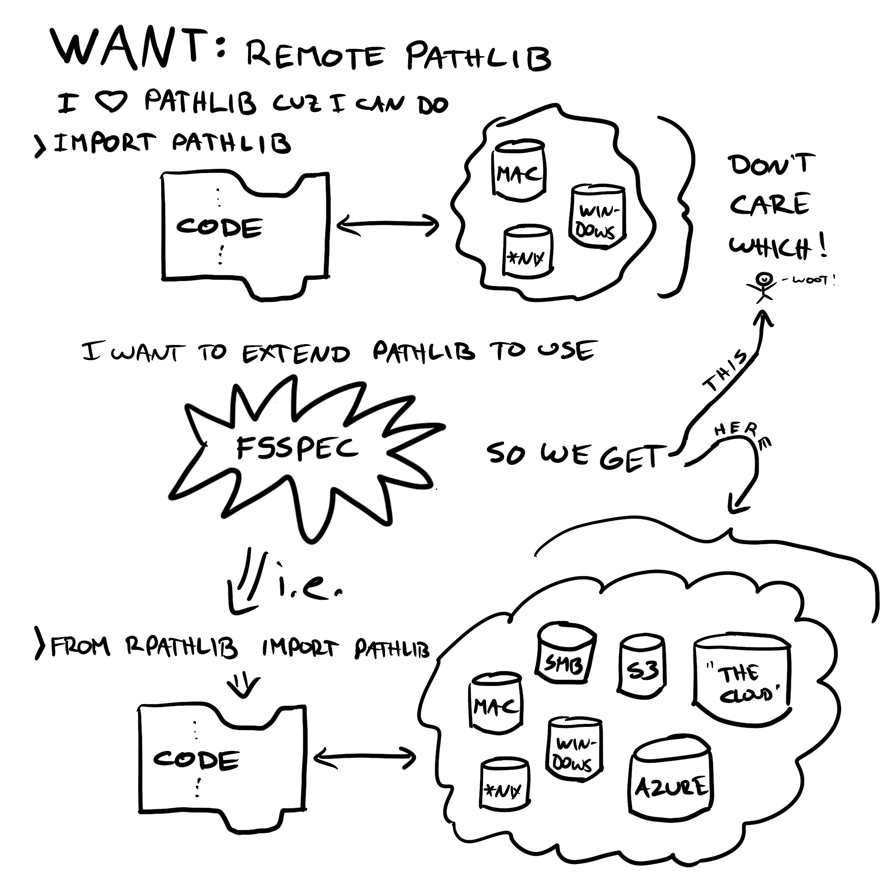

rpathlib-dev
==============================
_Authors: Kjell Wooding, Benoit Hamelin_

Strawman for an 'rpathlib' implementation.

`rpathlib` is an idea to extend the pathlib API to handle fsspec-style paths (and use fsspec under the hood to make these accesses)


Quick Start
-----------
```
>>> make create_environment
>>> conda activate rpathlib-dev
>>> make update_environment
```

Source code is in `src/`. Notebooks are in `notebooks/`. See [Projcet Organization](reference/easydata/file-reference.md) for more standard file locations.

For vastly more detailed "Getting Started" instructions, See the [Easydata Framework Getting Started Guide](reference/easydata/easydata.md).

rpathlib Spec and Strawman
----------

The original spec was this:



See sample implementation ideas starting at [00-strawman.ipynb](notebooks/00-strawman.ipynb)


--------

<p><small>This project was built using <a target="_blank" href="https://github.com/hackalog/easydata">Easydata</a>, a python framework aimed at making your data science workflow reproducible.</small></p>
